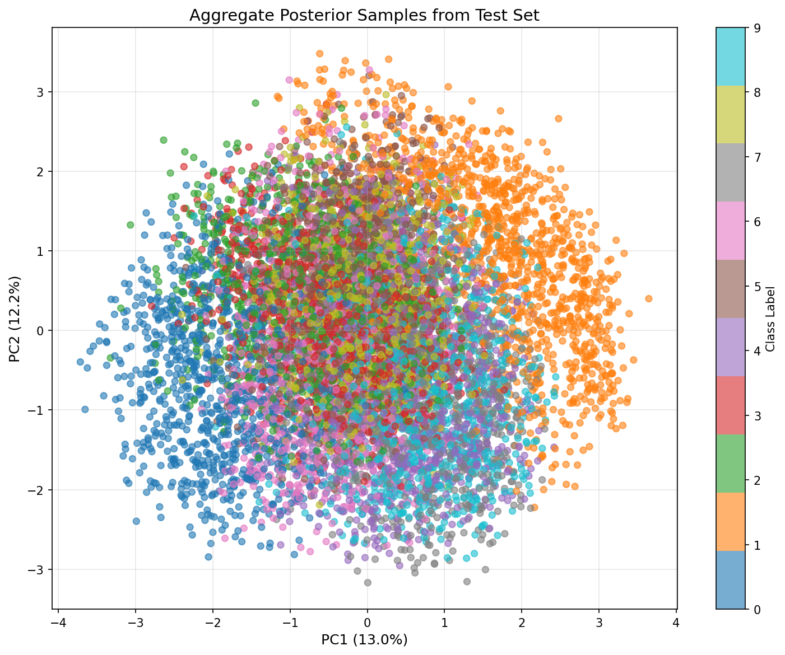
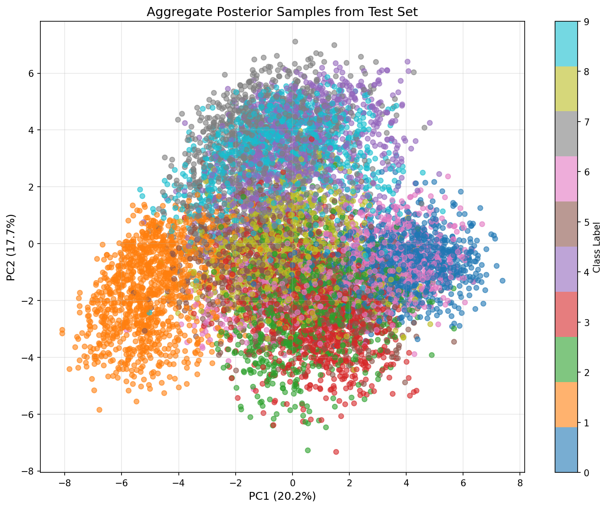
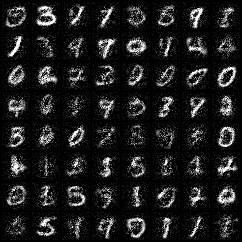
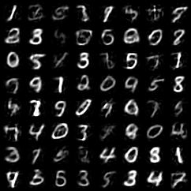

# Week 1 - Deep Latent Variable Models

Source questions: [Week1/exercise.md](../exercise.md)

## Theoretical Exercises

## Question 1.1: PPCA — ML estimate of $b$ is the data mean

Show that for the PPCA model $p(y\mid x) = \mathcal{N}(y \mid Wx + b, \sigma^2 I)$, the ML estimate is $\hat b = \bar x$.

1. Write the log-likelihood $\ell(\sigma^2, b, W) = \sum_n \ln p(x_n \mid \sigma^2, b, W)$.
2. Set $\partial \ell / \partial b = 0$ and solve.

**Answer:**

**Step 1 — Marginal in closed form.** Equation (5.6) of Tomczak (2024) gives the marginal of the PPCA model as a Gaussian:

$$p(x \mid \sigma^2, b, W) = \mathcal{N}(x \mid b,\; WW^\top + \sigma^2 I).$$

Let $C := WW^\top + \sigma^2 I$ (avoids overloading $\Sigma$).

**Step 2 — Log-likelihood.** With $\mathcal{D} = \{x_1, \dots, x_N\}$ iid, the joint factorises and the log converts the product to a sum. Using the multivariate Gaussian log-pdf $\ln \mathcal{N}(x \mid \mu, \Sigma) = -\tfrac{D}{2}\ln(2\pi) - \tfrac{1}{2}\ln |\Sigma| - \tfrac{1}{2}(x-\mu)^\top \Sigma^{-1}(x-\mu)$:

$$\ell(\sigma^2, b, W) = \sum_{n=1}^N \left[ -\tfrac{D}{2}\ln(2\pi) - \tfrac{1}{2}\ln |C| - \tfrac{1}{2}(x_n - b)^\top C^{-1}(x_n - b) \right].$$

**Step 3 — b-dependent part.** The constant and the log-det terms do not depend on $b$, so they vanish under $\partial / \partial b$. Only the quadratic survives:

$$\frac{\partial \ell}{\partial b} = -\tfrac{1}{2} \sum_{n=1}^N \frac{\partial}{\partial b}\, (x_n - b)^\top C^{-1}(x_n - b).$$

**Step 4 — Apply the matrix-calculus hint.** $C^{-1}$ is symmetric (since $C$ is symmetric positive definite). Using $\partial/\partial b\, (x-b)^\top W (x-b) = -2W(x-b)$ for symmetric $W$:

$$\frac{\partial \ell}{\partial b} = -\tfrac{1}{2} \sum_{n=1}^N \bigl(-2 C^{-1}(x_n - b)\bigr) = \sum_{n=1}^N C^{-1}(x_n - b) = C^{-1} \sum_{n=1}^N (x_n - b).$$

**Step 5 — Set to zero and solve.** Setting $\partial \ell / \partial b = 0$:

$$C^{-1} \sum_{n=1}^N (x_n - b) = 0.$$

Since $C$ is positive definite, $C^{-1}$ is invertible (its kernel is trivial), so

$$\sum_{n=1}^N (x_n - b) = 0 \;\;\Longleftrightarrow\;\; \sum_{n=1}^N x_n - N b = 0 \;\;\Longleftrightarrow\;\; \hat b = \frac{1}{N}\sum_{n=1}^N x_n = \bar x. \qquad \blacksquare$$

**Note.** The result $\hat b = \bar x$ does not depend on the specific covariance structure $WW^\top + \sigma^2 I$ — only on the fact that the covariance is invertible and does not depend on $b$. ML for the mean of any Gaussian with $b$-independent covariance is the sample mean.

## Question 1.2: KL form of ELBO + closed-form Gaussian KL

1. Show that $\mathbb{E}_{q_\phi(z\mid x)}[\ln q_\phi(z\mid x) - \ln p(z)] = \mathrm{KL}[q_\phi(z\mid x) \| p(z)]$.
2. Derive the closed-form $\mathrm{KL}[\mathcal{N}(\mu_1,\sigma_1^2) \| \mathcal{N}(\mu_2,\sigma_2^2)] = \ln(\sigma_2/\sigma_1) + (\sigma_1^2 + (\mu_1-\mu_2)^2)/(2\sigma_2^2) - 1/2$.

**Answer:**

### Part (a) — the second ELBO term is a KL divergence

By definition, the KL divergence is an expectation under $q$ of the log ratio of the two densities:

$$\mathrm{KL}[q_\phi(z\mid x) \,\|\, p(z)] = \int q_\phi(z\mid x) \, \ln\frac{q_\phi(z\mid x)}{p(z)}\, dz = \mathbb{E}_{z \sim q_\phi(z \mid x)}\!\left[\ln\frac{q_\phi(z\mid x)}{p(z)}\right].$$

Using $\ln(a/b) = \ln a - \ln b$:

$$\mathrm{KL}[q_\phi(z\mid x) \,\|\, p(z)] = \mathbb{E}_{z \sim q_\phi(z \mid x)}[\ln q_\phi(z\mid x) - \ln p(z)]. \qquad \blacksquare$$

This is exactly the second ELBO term in equation (5.17), so the two ELBO expressions are equivalent.

### Part (b) — closed-form KL between two univariate Gaussians

Let $q = \mathcal{N}(\mu_1, \sigma_1^2)$ and $p = \mathcal{N}(\mu_2, \sigma_2^2)$. From part (a):

$$\mathrm{KL}[q \,\|\, p] = \mathbb{E}_{z \sim q}[\ln q(z) - \ln p(z)].$$

**Substitute the univariate Gaussian log-pdf** $\ln \mathcal{N}(z \mid \mu, \sigma^2) = -\tfrac{1}{2}\ln(2\pi\sigma^2) - (z-\mu)^2/(2\sigma^2)$ for both densities (mind the minus distributing over $\ln p$):

$$\mathrm{KL}[q \,\|\, p] = \mathbb{E}_{z \sim q}\!\left[-\tfrac{1}{2}\ln(2\pi\sigma_1^2) - \frac{(z-\mu_1)^2}{2\sigma_1^2} + \tfrac{1}{2}\ln(2\pi\sigma_2^2) + \frac{(z-\mu_2)^2}{2\sigma_2^2}\right].$$

**Linearity of expectation.** Constants come out unchanged; only the quadratic terms keep $\mathbb{E}_q[\cdot]$:

$$= -\tfrac{1}{2}\ln(2\pi\sigma_1^2) + \tfrac{1}{2}\ln(2\pi\sigma_2^2) - \frac{\mathbb{E}_q[(z-\mu_1)^2]}{2\sigma_1^2} + \frac{\mathbb{E}_q[(z-\mu_2)^2]}{2\sigma_2^2}.$$

**Evaluate the two expectations under $q = \mathcal{N}(\mu_1, \sigma_1^2)$:**

- $\mathbb{E}_q[(z - \mu_1)^2] = \mathrm{Var}_q(z) = \sigma_1^2$ (definition of variance — $\mu_1$ is the mean of $z$ under $q$).
- $\mathbb{E}_q[(z - \mu_2)^2]$: expand the square and use $\mathbb{E}_q[z] = \mu_1$, $\mathbb{E}_q[z^2] = \sigma_1^2 + \mu_1^2$:

  $$\mathbb{E}_q[z^2 - 2\mu_2 z + \mu_2^2] = (\sigma_1^2 + \mu_1^2) - 2\mu_2\mu_1 + \mu_2^2 = \sigma_1^2 + (\mu_1 - \mu_2)^2.$$

  This is the bias-variance identity: expected squared distance from a non-centered point $\mu_2$ = variance + squared bias.

**Substitute and simplify the log term** (combine the two logs into a ratio; the $2\pi$ cancels; use $\tfrac{1}{2}\ln(\sigma_2^2/\sigma_1^2) = \ln(\sigma_2/\sigma_1)$):

$$\mathrm{KL}[q \,\|\, p] = \tfrac{1}{2}\ln\!\frac{2\pi\sigma_2^2}{2\pi\sigma_1^2} - \frac{\sigma_1^2}{2\sigma_1^2} + \frac{\sigma_1^2 + (\mu_1 - \mu_2)^2}{2\sigma_2^2} = \ln\frac{\sigma_2}{\sigma_1} + \frac{\sigma_1^2 + (\mu_1 - \mu_2)^2}{2\sigma_2^2} - \tfrac{1}{2}. \qquad \blacksquare$$

## Question 1.3: Two-level hierarchical VAE — ELBO derivation

Derive the two-level ELBO from $\ln p(x) = \ln \iint p(x\mid z_1) p(z_1\mid z_2) p(z_2)\,dz_1\,dz_2$, then reorganise the expectations to reach equation (5.82) of Tomczak (2024).

**Answer:**

### Setup

Two-level generative model: $p(x, z_1, z_2) = p(x\mid z_1)\, p(z_1\mid z_2)\, p(z_2)$. Bottom-up variational distribution: $Q(z_1, z_2 \mid x) = q(z_1 \mid x)\, q(z_2 \mid z_1)$.

### Step 1 — Multiply-and-divide by $Q$, then apply Jensen

Starting from the log-marginal and inserting $1 = Q/Q$:

$$\ln p(x) = \ln \iint p(x\mid z_1)\, p(z_1\mid z_2)\, p(z_2)\, dz_1\, dz_2 = \ln \iint Q(z_1, z_2\mid x) \cdot \frac{p(x\mid z_1)\, p(z_1\mid z_2)\, p(z_2)}{Q(z_1, z_2\mid x)}\, dz_1\, dz_2.$$

The double integral against the joint density $Q$ is an expectation under $Q$:

$$\ln p(x) = \ln \mathbb{E}_{Q(z_1, z_2 \mid x)}\!\left[\frac{p(x\mid z_1)\, p(z_1\mid z_2)\, p(z_2)}{Q(z_1, z_2\mid x)}\right].$$

Applying Jensen's inequality ($\ln$ is concave, so $\ln \mathbb{E}[Y] \geq \mathbb{E}[\ln Y]$):

$$\mathrm{ELBO}(x) = \mathbb{E}_{Q(z_1, z_2 \mid x)}\!\left[\ln \frac{p(x\mid z_1)\, p(z_1\mid z_2)\, p(z_2)}{q(z_2\mid z_1)\, q(z_1\mid x)}\right].$$

### Step 2 — Expand log of products and regroup into three pieces

Using $\ln(abc/de) = \ln a + \ln b + \ln c - \ln d - \ln e$ and regrouping:

$$\mathrm{ELBO}(x) = \mathbb{E}_Q\!\left[\ln p(x\mid z_1) - \ln \frac{q(z_1\mid x)}{p(z_1\mid z_2)} - \ln \frac{q(z_2\mid z_1)}{p(z_2)}\right].$$

The three pieces (named for what follows):
- **Group A:** $\ln p(x\mid z_1)$ — depends only on $z_1$ (reconstruction term).
- **Group B:** $\ln \frac{q(z_1\mid x)}{p(z_1\mid z_2)}$ — depends on both $z_1$ and $z_2$ (genuinely needs $\mathbb{E}_Q$).
- **Group C:** $\ln \frac{q(z_2\mid z_1)}{p(z_2)}$ — function of $z_2$ conditional on $z_1$ (becomes a KL).

### Step 3 — Reduce each group to its minimal expectation scope (Form 1)

**Key fact:** if $f$ doesn't depend on $z_2$, then $\mathbb{E}_Q[f(z_1)] = \mathbb{E}_{q(z_1\mid x)}[f(z_1)]$, because the inner $\int q(z_2\mid z_1)\, dz_2 = 1$.

- **Group A:** $\mathbb{E}_Q[\ln p(x\mid z_1)] = \mathbb{E}_{q(z_1\mid x)}[\ln p(x\mid z_1)]$ (collapses).
- **Group B:** stays as $\mathbb{E}_Q[\ln (q(z_1\mid x)/p(z_1\mid z_2))]$ (genuinely depends on both).
- **Group C:** factor $Q = q(z_1\mid x)\, q(z_2\mid z_1)$ and do the **inner $z_2$ integral first**:

  $$\mathbb{E}_Q\!\left[\ln \frac{q(z_2\mid z_1)}{p(z_2)}\right] = \int q(z_1\mid x) \underbrace{\left[\int q(z_2\mid z_1)\, \ln \frac{q(z_2\mid z_1)}{p(z_2)}\, dz_2\right]}_{= \,\mathrm{KL}[q(z_2\mid z_1)\, \|\, p(z_2)]\text{ (a function of }z_1\text{)}}\, dz_1 = \mathbb{E}_{q(z_1\mid x)}\!\bigl[\mathrm{KL}[q(z_2\mid z_1)\,\|\,p(z_2)]\bigr].$$

Putting the three groups together yields **Form 1**:

$$\boxed{\mathrm{ELBO}(x) = \mathbb{E}_{z_1 \sim q(z_1 \mid x)}[\ln p(x \mid z_1)] - \mathbb{E}_{Q(z_1, z_2 \mid x)}\!\left[\ln \frac{q(z_1\mid x)}{p(z_1\mid z_2)}\right] - \mathbb{E}_{z_1 \sim q(z_1 \mid x)}\!\bigl[\mathrm{KL}[q(z_2 \mid z_1)\,\|\,p(z_2)]\bigr].}$$

### Step 4 — Rebundle under a single $\mathbb{E}_Q$ to reach eq (5.82)

The reverse of Step 3 also holds **for free**: when an integrand doesn't depend on $z_2$, you can relabel $\mathbb{E}_{q(z_1\mid x)}$ as $\mathbb{E}_Q$ **without changing the integrand**, since $\int q(z_2\mid z_1)\, dz_2 = 1$. Apply this to terms 1 and 3 (term 2 is already under $\mathbb{E}_Q$), then merge by linearity:

$$\boxed{\mathrm{ELBO}(x) = \mathbb{E}_{Q(z_1, z_2\mid x)}\!\left[\ln p(x\mid z_1) - \ln \frac{q(z_1\mid x)}{p(z_1\mid z_2)} - \mathrm{KL}[q(z_2\mid z_1)\,\|\,p(z_2)]\right].} \qquad \text{(eq 5.82) } \blacksquare$$

## Programming Exercises

## Question 1.4: VAE Implementation Inspection

Inspect the code in vae_bernoulli.py and answer the following questions:
- How is the reparametrisation trick handled in the code?
- Consider the implementation of the ELBO. What is the dimension of self.decoder(z).log_prob(x) and of td.kl_divergence(q, self.prior.distribution)?
- The implementation of the prior, encoder and decoder classes all make use of td.Independent. What does this do?
- What is the purpose of using the function torch.chunk in GaussianEncoder.forward?

**Answer:**

The reparameterization trick is implemented using `q.rsample()` in the ELBO computation. Instead of using `sample()` which breaks gradient flow, `rsample()` performs a reparameterized sample that allows backpropagation through the sampling operation. Mathematically, it samples from a standard normal distribution and transforms it using the learned parameters: z = μ + σ * ε, where ε ~ N(0,1), making this transformation differentiable and enabling gradient flow through the encoder.

For the ELBO implementation:
- The dimension of `self.decoder(z).log_prob(x)` is `(batch_size,)`, where each entry is the total log probability for one image in the batch. This is because `td.Independent` sums the log probabilities over all pixels for each sample.
- The dimension of `td.kl_divergence(q, self.prior())` is also `(batch_size,)`, as the KL divergence is computed independently for each sample in the batch.

Both terms return a vector with one value per sample, not per pixel, because the distribution objects aggregate over the image dimensions.

`td.Independent` creates a distribution where each variable (e.g., pixel or latent dimension) is treated as independent. In the code, this means the prior, encoder, and decoder model each pixel or latent variable as independent, and the log probabilities are aggregated (summed) across all those dimensions for each sample.

The function `torch.chunk` in `GaussianEncoder.forward` splits the output of the encoder network into two tensors along the last dimension: one for the mean and one for the standard deviation of the Gaussian distribution. This is necessary because the encoder network outputs both parameters concatenated together, and they need to be separated to define the Gaussian distribution for the latent variables.

## Question 1.5: VAE with Bernoulli Output - Extensions

Add the following functionality to the implementation (vae_bernoulli.py) of the VAE with Bernoulli output distributions:
- Evaluate the ELBO on the binarised MNIST test set.
- Plot samples from the approximate posterior and colour them by their correct class label for each datapoint in the test set (i.e., samples from the aggregate posterior).
- Implement it such that for latent dimensions larger than two (M > 2), do PCA and project the sample onto the first two principal components (e.g., using scikit-learn).

**Answer:**

- The ELBO on the binarised MNIST test set is evaluated using the `evaluate_elbo` function in `plot_posterior.py`, which computes the average ELBO across all test samples by iterating through the test loader and calling the model's `elbo` method.
- Samples from the approximate posterior are visualized using the `plot_aggregate_posterior` function. This function collects latent samples for each test datapoint, colors them by their true class label, and saves the resulting plot. If the latent dimension $M > 2$, PCA is applied to project the samples onto the first two principal components before plotting.
- The resulting plot can be found here:  
  
- This visualization shows how the VAE's latent space clusters according to digit class, and how PCA is used for higher-dimensional latent spaces.

## Question 1.6: VAE with Mixture of Gaussian Prior

Extend the VAE with Bernoulli output distributions (vae_bernoulli.py) to use a mixture of Gaussian prior (MoG). For your implementation:
- Evaluate the test set ELBO. Do you see better performance?
- Plot the samples from the approximate posterior. How does it differ from the model with the Gaussian prior? Do you see better clustering?

**Answer:**

**Test Set ELBO Comparison:**
- Gaussian Prior: **-93.12**
- Mixture of Gaussians Prior: **-91.83**

The MoG prior achieves a higher (less negative) ELBO, indicating better performance. The improvement is approximately 1.3 nats per sample.

**Posterior Visualization:**

Gaussian Prior:

Mixture of Gaussians Prior:

**Observations:**
- The clusters are more clearly separated with the MoG prior compared to the Gaussian prior.
- The first two principal components capture more of the variance with MoG, indicating that the latent space has learned a more structured representation.
- Digit classes form tighter, more distinct clusters with MoG, suggesting better class separation in the latent space.
- The MoG prior naturally aligns with the multi-class structure of MNIST, where each mixture component can specialize for different digit types.

The MoG prior provides both quantitative improvement (higher ELBO) and qualitative improvement (better clustering).

## Question 1.7: VAE with Continuous Output Distributions

Consider the pixel values in MNIST as continuous and experiment with different output distributions. Implement a multivariate Gaussian output distribution. You should experiment with learning the variance of each pixel and having a fixed variance for all pixels:
- How is the qualitative sample quality?
- Rather than sampling from p(x|z), try to sample z ∼ p(z) and then show the mean of the output distribution, p(x|z). Does the mean qualitatively look better?

Optional: You can also try the Continuous Bernoulli output distribution.

**Answer:**

**Qualitative Sample Quality with Multivariate Gaussian Decoder:**

With the multivariate Gaussian output distribution using continuous MNIST pixel values, the samples show reasonable quality with visible digit structures. However, there is noticeable graininess/noise in the generated samples due to the stochastic sampling step.

**Comparison: Sampling from p(x|z) vs. Mean of p(x|z):**

The mean predictions are **extremely better** than sampling from the distribution:

- **Sampling from p(x|z)**: The samples exhibit significant pixel-level noise because we are sampling from a Gaussian distribution for each pixel. This adds random Gaussian noise on top of the decoder's learned parameters, resulting in grainy, noisy-looking digits.

- **Using the mean of p(x|z)**: The mean predictions are dramatically cleaner and sharper. By taking the mean of the Gaussian distribution without the sampling noise step, we get the decoder's most confident prediction. The resulting images show well-defined digit structures with crisp edges and minimal noise.

**Key Insight:**

The mean is qualitatively superior because it eliminates the final stochastic layer. When we sample from p(x|z), we introduce additional pixel-level Gaussian noise which obscures the learned structure. The mean, however, captures the deterministic part of what the decoder learned, resulting in much cleaner and more interpretable samples. This suggests that for generation quality, using the decoder's mean prediction (`decoder(z).mean`) produces significantly better visual results compared to sampling (`decoder(z).sample()`).

**Visual Comparison:**

Noisy Samples (sampling from p(x|z)):

Mean Samples (mean of p(x|z)):

As shown in the figures above, the mean samples are dramatically cleaner and sharper with well-defined digit structures, while the noisy samples exhibit significant grain and pixelated artifacts from the stochastic sampling.

## Question 1.8: VAE with CNN-Based Architecture (Optional)

Extend the VAE with Bernoulli output distributions (vae_bernoulli.py) to use a CNN-based encoder and decoder. For your new implementation:
- When sampling from a trained model, do you see a qualitative improvement in sample quality?
- Evaluate the test set ELBO. Do you see better performance?

**Answer:**

<!-- Add your answer here -->
