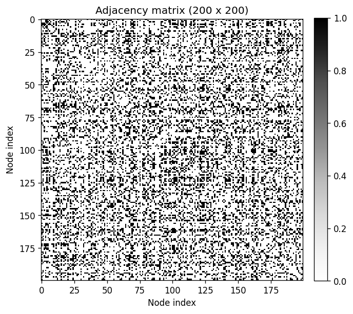
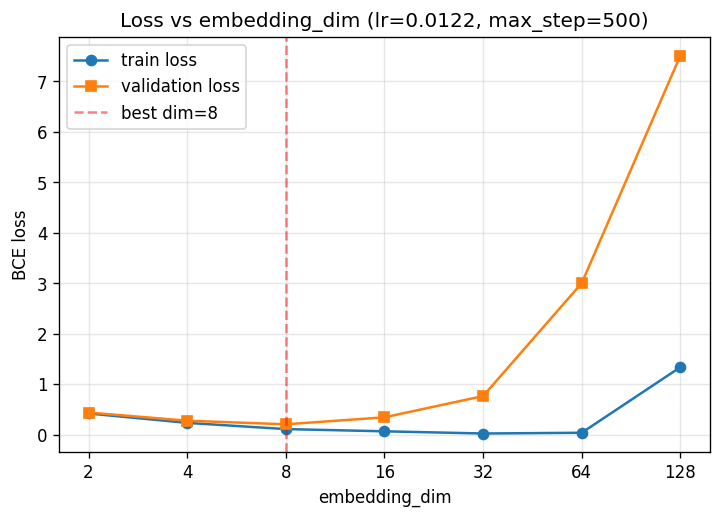

# Week 9 Answers: Graphs and Node Embeddings

Source questions: [Week9/exercise.md](../exercise.md)

## Theoretical Exercises

## Question A.1: Eigenvector centrality for each node

**Answer:**

Eigenvector centrality for each node is given by the components of the principal eigenvector (corresponding to the largest eigenvalue λ₁ = 3.646).

By examining the adjacency matrix, all nodes have degree 3 except node 6 (0-indexed) which has degree 6 — identifying it as the central hub. The remaining nodes are symmetric and must share the same centrality.

The centralities are read directly from the first column of the eigenvector matrix E. Since eigenvectors are not unique in sign and centralities must be positive, we flip the sign of the (all-negative) principal eigenvector:

- **Nodes 0–4 and 6** (degree-3 nodes): centrality ≈ **0.339**
- **Node 5** (degree-6 hub): centrality ≈ **0.558**

## Question A.2: Clustering coefficient for each node

**Answer:**

Local clustering coefficient: Cᵢ = 2Lᵢ / (kᵢ(kᵢ − 1)), where kᵢ = degree, Lᵢ = edges among neighbors.

From the graph structure:
- **Nodes 0–4 and 6** (degree-3 nodes): each node's 3 neighbors form a triangle (fully connected), so Lᵢ = 3.  
  Cᵢ = 2·3 / (3·2) = **1**
- **Node 5** (hub, degree 6): 6 neighbors split into two fully-connected triplets, so L₅ = 3 + 3 = 6.  
  C₅ = 2·6 / (6·5) = 12/30 = **0.4**

## Question B.1: Final node probability distribution after one random walk step

**Answer:**

The final distribution is given by **p' = AD⁻¹p**, where A is the adjacency matrix, D is the diagonal degree matrix, and p is the starting distribution.

Starting from uniform p = [1/7, …, 1/7] and using the same 7-node graph (nodes 0–4 and 6 have degree 3; node 5 is the hub with degree 6):

For each degree-3 node j (connected to 2 degree-3 nodes and the hub):
- p'_j = 2·(1/7)/3 + 1·(1/7)/6 = 2/21 + 1/42 = **5/42 ≈ 0.119**

For the hub node (degree 6, connected to all 6 degree-3 nodes):
- p'_hub = 6·(1/7)/3 = 6/21 = **2/7 ≈ 0.286**

Verification: 6·(5/42) + 2/7 = 30/42 + 12/42 = 1 ✓

## Question B.2: Number of distinct paths of length t from node 1

**Answer:**

Represent the starting state as a one-hot vector x (1 at node 1, 0 elsewhere). Then **Aᵗ·x** gives the number of distinct paths of length t from node 1 to every other node.

- A·x = column 1 of A = direct neighbors of node 1
- A²·x = paths of length 2 from node 1
- Aᵗ·x = paths of length t from node 1 (entry j = number of length-t paths from node 1 to node j)

## Question C.1: Show 1 − σ(x) = σ(−x) and spot the typo in eq. 3.12

**Answer:**

**Proof:**

1 − σ(x) = 1 − 1/(1+e⁻ˣ) = e⁻ˣ/(1+e⁻ˣ)

Multiply numerator and denominator by eˣ:

= 1/(eˣ+1) = σ(−x) ∎

**Typo in eq. 3.12:** The second term has `log(−σ(z_u⊤z_vn))`, which takes the log of a negative number (invalid). The minus sign should be inside σ as its argument: `log(σ(−z_u⊤z_vn))`, i.e. `log(1 − σ(z_u⊤z_vn))`.

## Question C.2: Cross entropy loss for single observation S_{u,v}

**Answer:**

For a single observation S_{u,v} ∈ {0, 1} with predicted edge probability P_{u,v} = DEC(z_u, z_v) = σ(z_u^⊤ z_v + b), the binary cross-entropy loss is

L(S_{u,v}, P_{u,v}) = − S_{u,v} log(P_{u,v}) − (1 − S_{u,v}) log(1 − P_{u,v}).

When S_{u,v} = 1 (an observed edge) only the first term survives and the loss penalizes a low predicted probability; when S_{u,v} = 0 (no edge) only the second term survives and the loss penalizes a high predicted probability.

## Question C.3: Edge probability when embeddings are orthogonal and b = 0

**Answer:**

With z_u ⊥ z_v we have z_u^⊤ z_v = 0, and with bias b = 0 the sigmoid argument is 0. Therefore

P_{u,v} = σ(0) = 1 / (1 + e^0) = 1/2 = **0.5**

— the model assigns a 50/50 (coin-flip) probability to the edge, i.e. maximal uncertainty.

## Programming Exercises

## Question D.1: Examine and run graph data loading code

**Answer:**

The graph is loaded as adjacency matrix `A` of shape (n_nodes × n_nodes). `idx_all_pairs = torch.triu_indices(n_nodes, n_nodes, 1)` gives the upper-triangular index pairs (excluding the diagonal/self-loops), and `target = A[idx_all_pairs[0], idx_all_pairs[1]]` is a flat 1-D vector of length n·(n−1)/2 holding the 0/1 entries of `A` at those pairs. Only the upper triangle is used as an optimization since the adjacency matrix is symmetric — the lower triangle would just repeat the same data.

## Question D.2: Examine and run the Shallow class implementation

**Answer:**

`torch.nn.Embedding(n_nodes, embedding_dim)` is a learnable lookup table that stores one embedding vector per node. In the forward pass, `rx` and `tx` are lists of node indices (source/target of the candidate pairs); `self.embedding.weight[rx]` and `self.embedding.weight[tx]` fancy-index the table to fetch the corresponding embedding vectors in a batched, vectorized way. The element-wise product followed by `.sum(1)` computes the dot product between the two embedding vectors per pair, then a bias is added and `sigmoid` maps the score to a link probability in [0, 1].

## Question D.3: Fit model on entire graph, experiment with max_step and embedding dimensions

**Answer:**

**Varying `max_step` (embedding_dim = 2):**

| max_step | training loss |
|----------|---------------|
| 1000     | ≈ 0.425       |
| 1500     | ≈ 0.418       |
| 2500     | ≈ 0.418       |
| 5000     | ≈ 0.418       |
| 10000    | ≈ 0.418       |

Beyond ~1500 steps the optimizer has essentially converged and additional steps barely lower the loss.

**Varying `embedding_dim` (max_step = 10000):**

| embedding_dim | training loss |
|---------------|---------------|
| 2             | ≈ 0.418       |
| 4             | ≈ 0.230       |
| 8             | ≈ 0.079       |
| 16            | ≈ 0.031       |

Embedding dimension has by far the biggest impact on training loss: more dimensions give the model more capacity to fit the adjacency matrix, so the loss drops sharply at first and will eventually plateau as the model can fit the training graph essentially perfectly — at the cost of overfitting (addressed in D.4 with a validation split).

## Question D.4: Modify code to use train/validation split

**Answer:**

The 19,900 un-ordered node pairs are randomly split 80 / 20 → **15,920 training pairs** and **3,980 validation pairs** (seed 42). The model is trained on the training pairs only and selected by minimum validation BCE.

Hyperparameters were searched with **Optuna** (TPE sampler, 40 trials) over `embedding_dim ∈ {2, 4, 8, 16, 32, 64, 128}`, `lr ∈ [1e-3, 5e-2]` (log-uniform), and `max_step ∈ {500, 1000, …, 3000}`.

**Best hyperparameters:**

| parameter      | value    |
|----------------|----------|
| embedding_dim  | **8**    |
| lr             | 0.01222  |
| max_step       | 500      |
| best val loss  | **0.2036** |

**Sweep over `embedding_dim`** (using the best `lr` and `max_step`):

| embedding_dim | train loss | validation loss |
|---------------|-----------:|----------------:|
| 2             | 0.4177     | 0.4365          |
| 4             | 0.2321     | 0.2750          |
| **8**         | **0.1087** | **0.2036**      |
| 16            | 0.0647     | 0.3421          |
| 32            | 0.0214     | 0.7627          |
| 64            | 0.0361     | 3.0000          |
| 128           | 1.3353     | 7.5086          |

**Observation:** train loss keeps decreasing as `embedding_dim` grows, but validation loss is U-shaped — it bottoms out at **dim = 8** and then explodes (overconfident wrong predictions on held-out pairs → BCE blows up). This is classic overfitting: with only ~15.9k training pairs and 200 nodes, beyond 8 dimensions the model has enough capacity to memorize the training labels at the cost of generalization. The optimal embedding dimension on the validation set is therefore **8**.

## Question D.5: Hand in predictions (link_probabilities.pt)

**Answer:**

<!-- Add your answer here -->
